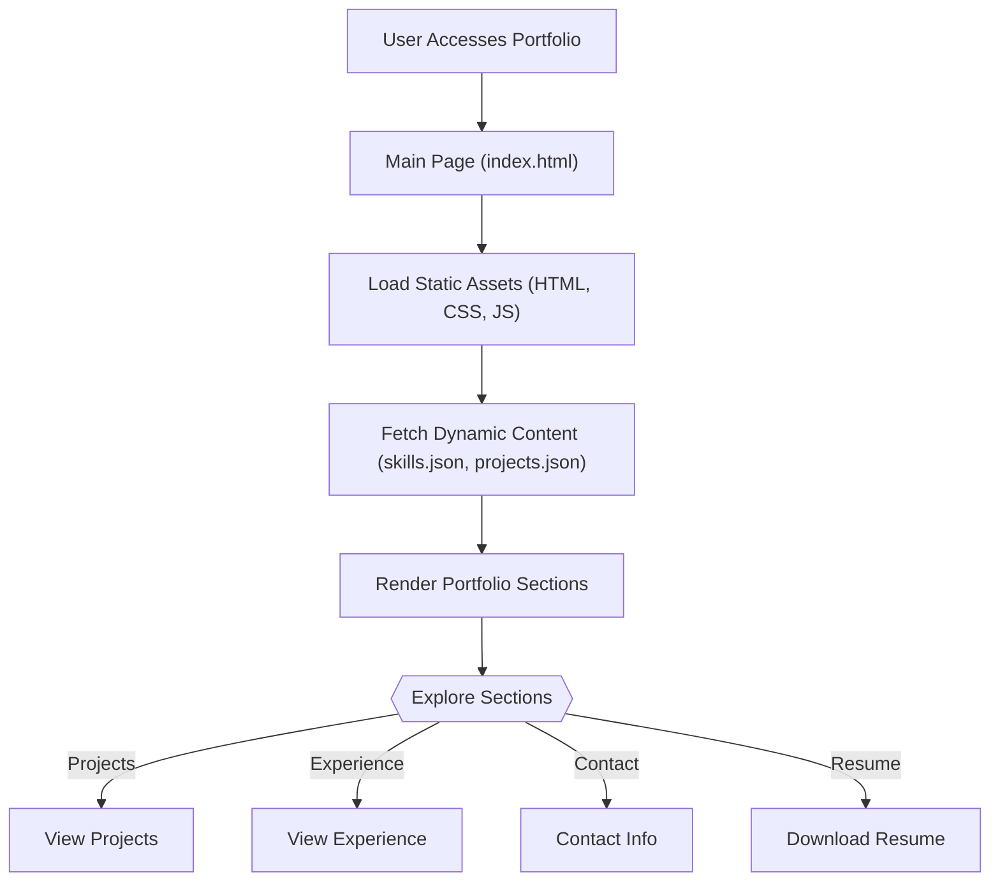

# 🚀 Dynamic Portfolio Website

<p align="center"></p>

## Short Description
Dive into a meticulously crafted personal portfolio website designed to brilliantly showcase a developer's skills, projects, and professional journey. This dynamic and responsive platform serves as the ultimate digital resume, bringing technical expertise to life through engaging content and a smooth user experience. Engineered with modern web standards, it ensures your achievements are presented in the most impactful way possible.

## ✨ Key Features
*   **Intuitive Navigation**: Seamlessly browse through sections like "Projects," "Experience," and "Skills" with a clean and responsive interface.
*   **Dynamic Content Loading**: Projects and skills are loaded from `projects.json` and `skills.json` files, making content updates effortless without touching the core HTML.
*   **Comprehensive Project Showcase**: A dedicated section to highlight personal and professional projects, complete with images and descriptions.
*   **Detailed Experience Timeline**: Chronicle your professional journey and academic achievements in a clear, engaging format.
*   **Interactive Design Elements**: Enhanced user experience with modern CSS styling and JavaScript interactions, including an engaging particles effect.
*   **Integrated Resume**: Easily downloadable resume (`assests/resume.pdf`) for quick access by potential employers.
*   **Custom 404 Page**: A polished, custom-designed 404 error page (`404.html`) ensuring a consistent brand experience even on broken links.
*   **Automated CI/CD**: Leverages GitHub Actions (`.github/workflows/ci-cd.yml`) for streamlined deployment and continuous integration.

## Who is this for?
This project is for **developers, designers, and tech professionals** who want a professional, customizable, and high-performance platform to:
*   **Showcase their portfolio** to recruiters and potential clients.
*   **Present their skills and experience** in an organized and engaging manner.
*   **Maintain an up-to-date digital presence** with minimal effort.
*   **Learn about modern static site development** best practices, including CI/CD.

## Technology Stack & Architecture
This portfolio is built on a robust and widely accessible web stack, ensuring broad compatibility and ease of deployment:

*   **Frontend**: HTML5, CSS3, JavaScript (Vanilla JS, with `particles.min.js` for visual effects)
*   **Content Management**: JSON files (`skills.json`, `projects.json`) for dynamic data loading.
*   **Styling**: Custom CSS (`style.css`, `404.css`) for a unique and polished look.
*   **Deployment**: GitHub Actions for Continuous Integration and Continuous Deployment (CI/CD).
*   **Development Tools**: `.vscode` settings for consistent development environment.

## 📊 Architecture & Database Schema
This project functions as a static site, serving content directly to the browser. Data for skills and projects is managed through local JSON files, eliminating the need for a traditional database. The architecture is straightforward: user requests content, and the server (or hosting service) delivers pre-built HTML, CSS, and JavaScript. The JavaScript then dynamically populates sections using data from the JSON files.



## ⚡ Quick Start Guide
Get your own version of this stunning portfolio up and running in no time!

1.  **Clone the Repository:**
    ```bash
    git clone https://github.com/SiddhiXCode05/portfolio_website.git
    cd portfolio_website
    ```
2.  **Open in Browser:**
    Simply open the `index.html` file in your preferred web browser to view the portfolio locally.
    ```bash
    # For a quick local server (optional but recommended for full functionality)
    # If you have Python:
    python -m http.server 8000
    # Then navigate to http://localhost:8000
    ```
3.  **Customize Content**:
    *   Edit `skills.json` and `projects.json` to update your skills and project details.
    *   Replace `assests/resume.pdf` with your own resume.
    *   Update images in `assests/images/` with your personal branding and project visuals.
    *   Modify `index.html`, `experience/index.html`, `projects/index.html` for structural changes or personalized text.

## 📜 License
This project is licensed under the [MIT License](LICENSE).